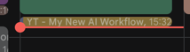

## Tired of manually tracking what I watched
### After adding the addon to Firefox it'll create calendar entries automatically

## is it ready?
Yes!

## How to add to Firefox?
Go to `about:debugging` and use `Load Temporary Add-on…`

### Demo:



____

### How to config?:

Create `config.js` with `Google Calendar Credentials`:

```
const GOOGLE_CONFIG = {
  client_email: "",
  private_key: "",
  calendar_id: ""
};
```

### Google Service Account setup
```
- console.cloud.google.com -> new project -> enable Google Calendar API
- Credentials -> Create Credentials -> Service Account -> Keys -> Add Key -> JSON
- In Google Calendar: settings (dots) -> Settings and sharing -> Share with specific people -> add client_email -> Make changes to events
- Share Calendar ID with Service Account (Calendar view -> Calendar Settings (cog) -> Share to some1)
```


    private_key needs literal, not real newlines — paste it straight from the downloaded JSON


What's next?
The goal was automatic caption gathering and generating a description from the watched fragment. Turns out captions are limited by default proxy or paid API only

- 10$/m - [Rapid-api Captions](https://rapidapi.com/solid-api-solid-api-default/api/youtube-transcript3/playground/apiendpoint_b46d1962-a219-453c-afd6-b94a336a61ae)
- 3.5$/m - [Proxy - Rotating Residential](https://www.webshare.io/pricing)
- OpenAI gpt-04-mini requests - [OpenAi Platform](https://platform.openai.com) 

## licence
Do whatever you like
